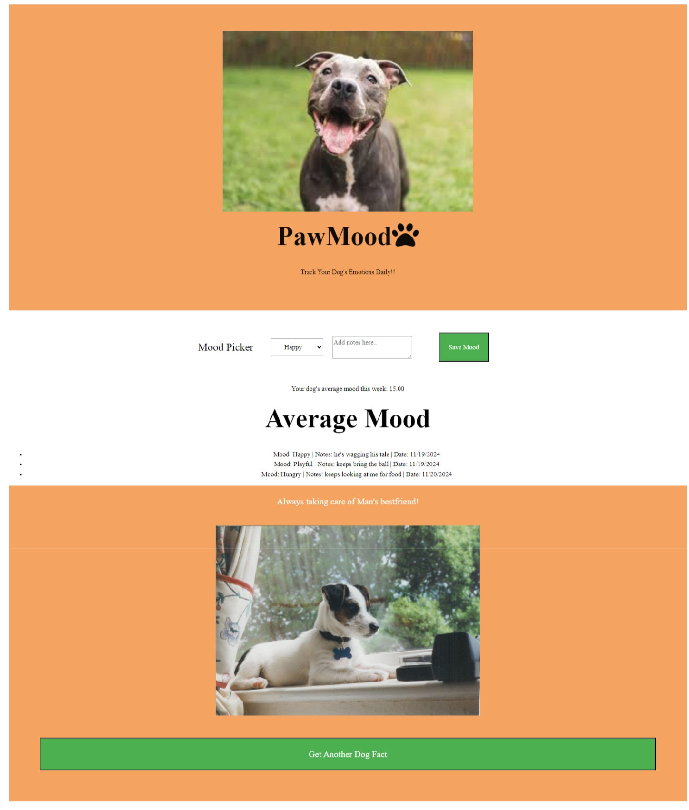
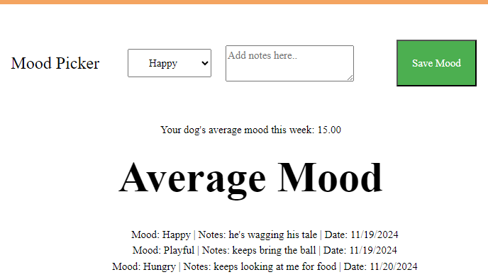

# PawMood - Dog Mood Tracker App

Welcome to **PawMood**! The app that helps you understand your dog's mood in real-time. With PawMood, you can easily identify whether your dog is happy, anxious, playful, or stressed, and get personalized tips to improve their well-being.

---

## Features

- **Mood Detection**: PawMood analyzes your dog’s behavior to provide insights into their mood.
- **Daily Activity Tracker**: Log your dog’s activities such as walks, playtime, meals, and more.
- **Personalized Tips**: Get customized suggestions to help your dog feel happier, calmer, or more playful.
- **Mood Trends**: Track your dog’s mood over time to spot patterns and adjust routines as needed.
---

## Getting Started

### Installation

1. Download **PawMood** from the App Store.
2. Set up your dog’s profile by entering their name, breed, and age.
3. Start logging your dog’s activities by tracking their walks, meals, playtime, and any behaviors you notice throughout the day.

### How It Works

- **Mood Analysis**: As you log your dog’s activities, PawPal will analyze their behavior and mood based on factors like body language and sounds.
- **Real-Time Feedback**: PawMood will provide immediate insights into your dog’s mood, such as "playful," "anxious," or "tired."
- **Personalized Tips**: Based on the mood detected, you’ll receive recommendations like extra playtime for energy, calming activities for anxiety, or suggestions for enriching their environment.

---

## Requirements

- **Operating System**: iOS 15+ or Android 
- **Internet Connection**: Required for syncing data and receiving updates.

---

## Support

If you have any questions or run into issues while using PawPal, feel free to contact our support team:

- **Email**: support@pawmood.com
- **Phone**: (123) 456-7890
- **Website**:  https://andresz25.github.io/PawMood-Project-1/

---

## Privacy & Security

PawMood takes your privacy seriously. All data collected is securely stored and will only be used to improve your dog’s experience with the app. 

---

## Contributing

We welcome contributions to PawMood! If you have suggestions for new features, improvements, or bug fixes, feel free to reach out. 
---

## License

PawMood is open source and available under the MIT License.

---

## Disclaimer

PawMood is designed for informational purposes and is not a substitute for professional veterinary advice. Always consult a veterinarian if you have concerns about your dog’s health or behavior.

---

Thank you for using **PawMood**! We hope it helps you create a stronger, happier bond with your dog. 🐾
